# Web Scanner

**Strichcodes und QR-Codes scannen – und sofort sehen, wo jedes Stück liegt.**

Web-App für Handy, Tablet und PC. Läuft im **kostenlosen Tarif von Cloudflare**, braucht keine Installation aus dem App-Store und funktioniert auf iPhone, Android und am PC gleich. Jede Person hat ein **eigenes Konto**, jede Bewegung landet in einem **Protokoll, das sich nicht ändern lässt**.

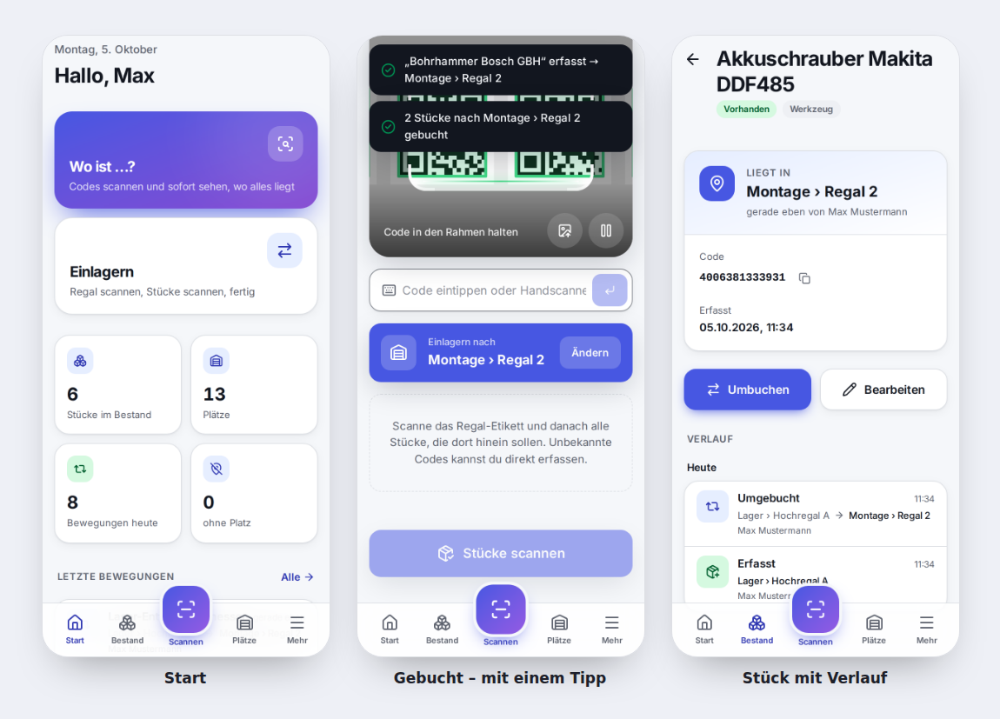

---

## Inhalt

- [Funktionen](#funktionen)
- [So funktioniert’s](#so-funktionierts)
  - [1. Einrichten und anmelden](#1-einrichten-und-anmelden)
  - [2. Abteilungen und Regale anlegen](#2-abteilungen-und-regale-anlegen)
  - [3. Etiketten drucken](#3-etiketten-drucken)
  - [4. Scannen: „Wo ist …?“ und „Einlagern“](#4-scannen-wo-ist--und-einlagern)
  - [5. Bestand und Protokoll](#5-bestand-und-protokoll)
  - [6. Benutzer verwalten](#6-benutzer-verwalten)
- [Fotos und Kategorie-Symbole](#fotos-und-kategorie-symbole)
- [Passwort ändern oder vergessen](#passwort-ändern-oder-vergessen)
- [Rollen](#rollen)
- [Am PC](#am-pc)
- [Hell und dunkel](#hell-und-dunkel)
- [Auf Cloudflare veröffentlichen (kostenlos)](#auf-cloudflare-veröffentlichen-kostenlos) · [ausführliche Anleitung](docs/cloudflare-einrichten.md)
- [Entwicklung](#entwicklung)

---

## Funktionen

| | |
|---|---|
| 📷 **Scannen mit der Kamera** | QR, DataMatrix, Code 128/39/93, EAN-13/8, UPC, ITF, Codabar. Mehrere Codes nacheinander oder gleichzeitig im Bild, Ton + Vibration, Taschenlampe. |
| 🖼️ **Foto auswerten** | Ein Foto mit vielen Etiketten → alle Codes auf einmal. |
| ⌨️ **Handscanner & Eintippen** | USB-/Bluetooth-Handscanner und manuelle Eingabe funktionieren genauso. |
| 📍 **„Wo ist …?“** | Zu jedem gescannten Stück: Abteilung › Regal, wann und von wem zuletzt bewegt. |
| 📦 **Einlagern / Umbuchen** | Regal-Etikett scannen → Stücke scannen → ein Tipp. Alles oder nichts. |
| 📸 **Fotos** | Foto beim Erfassen oder später aufnehmen – wird automatisch verkleinert und als Vorschaubild überall angezeigt. |
| 🎨 **Kategorie-Symbole** | Jede Kategorie bekommt automatisch ein passendes Symbol und eine Farbe; die Leitung kann beides ändern. |
| ➕ **Direkt erfassen** | Unbekannter Code? Name eingeben – das Stück liegt sofort im gescannten Regal. |
| 🏷️ **QR-Etiketten** | Für Regale und Abteilungen, auf A4-Bögen (21 oder 8 pro Seite). |
| 🔎 **Bestand** | Suche nach Name, Code, Kategorie; Filter „ohne Platz“, „defekt“, „ausgemustert“. |
| 🕓 **Protokoll** | Jede Bewegung und Änderung – wer, was, wann, von wo nach wo. Unveränderbar. Export als CSV für Excel. |
| 👥 **Konten & Rollen** | Leser · Mitarbeiter · Leitung · Admin. Startpasswort muss geändert werden, Sperre nach 5 Fehlversuchen. |
| 🌗 **Hell / Dunkel** | Automatisch nach Gerät oder fest eingestellt. Große Knöpfe – auch mit Handschuhen bedienbar. |
| 📱 **Als App installierbar** | „Zum Startbildschirm hinzufügen“ – startet dann wie eine normale App. |

---

## So funktioniert’s

### 1. Einrichten und anmelden

Beim allerersten Aufruf legst du das **erste Konto** an – es bekommt alle Rechte (Admin). Danach meldet sich jede Person mit ihrem **eigenen Konto** an. Die Startseite zeigt die ersten Schritte, bis Plätze angelegt sind.

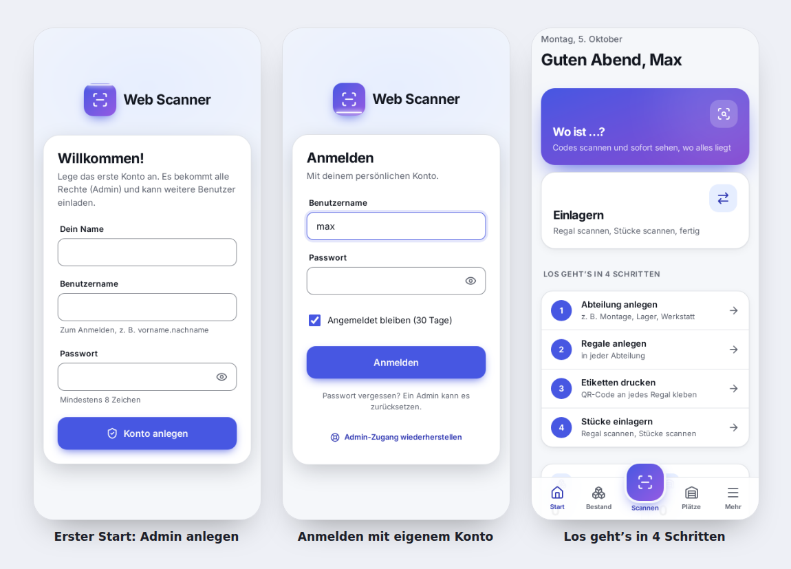

### 2. Abteilungen und Regale anlegen

Unter **Plätze** legst du Abteilungen an (z. B. Montage, Lager) und darin die Regale. Viele Regale gehen auf einmal: „Regal 1“ bis „Regal 20“. Jedes Regal bekommt automatisch einen eigenen QR-Code.

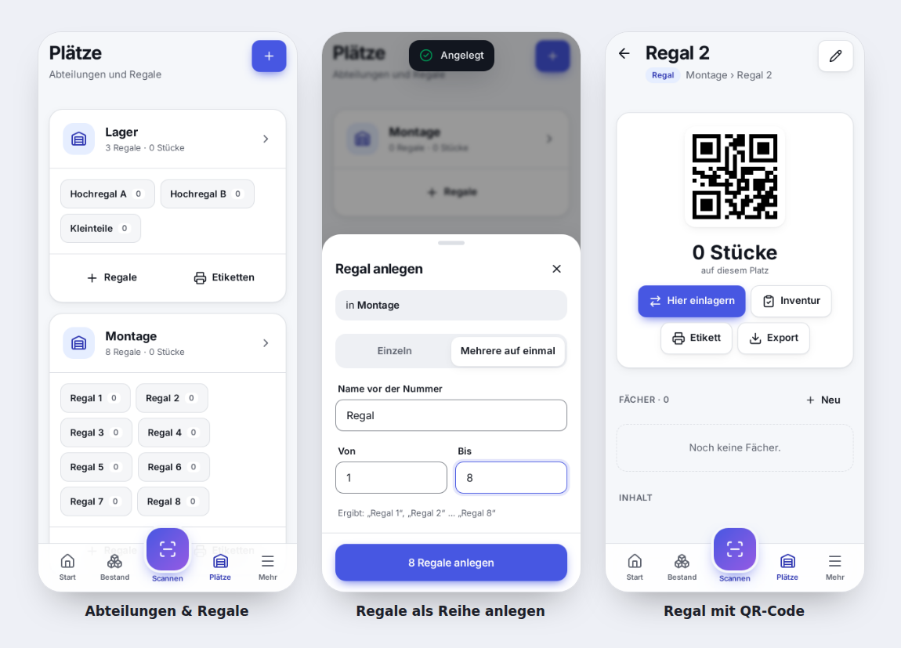

### 3. Etiketten drucken

Pro Abteilung oder für einzelne Regale: **Etiketten drucken** öffnet eine Druckansicht für A4-Etikettenbögen. Ausdrucken, ans Regal kleben – fertig.

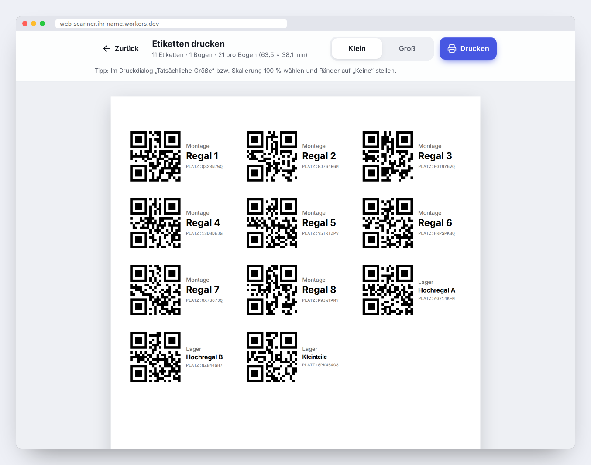

> Tipp: Im Druckdialog „Tatsächliche Größe“ bzw. Skalierung 100 % wählen und Ränder auf „Keine“ stellen.

### 4. Scannen: „Wo ist …?“ und „Einlagern“

- **Wo ist …?** – Codes scannen, auch mehrere auf einmal. Zu jedem Stück steht groß, wo es liegt.
- **Einlagern** – zuerst das **Regal-Etikett** scannen, dann alle Stücke, die hinein sollen. Ein Tipp auf „Einlagern“ bucht alle zusammen.
- **Unbekannter Code** – „Neu erfassen“, Namen eingeben, fertig. Das Stück liegt gleich im gescannten Regal.

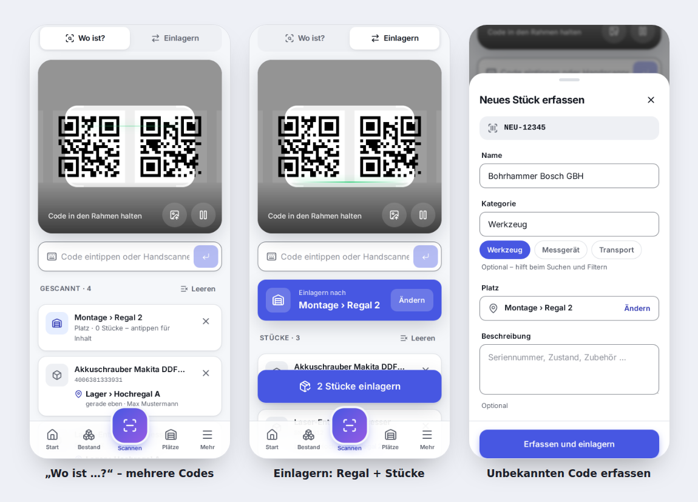

### 5. Bestand und Protokoll

Im **Bestand** findest du jedes Stück über die Suche oder die Filter. Das **Protokoll** zeigt lückenlos, wer was wann wohin gebracht hat – nach Zeitraum und Person filterbar und als **CSV für Excel** exportierbar. Einträge im Protokoll können nicht geändert oder gelöscht werden.

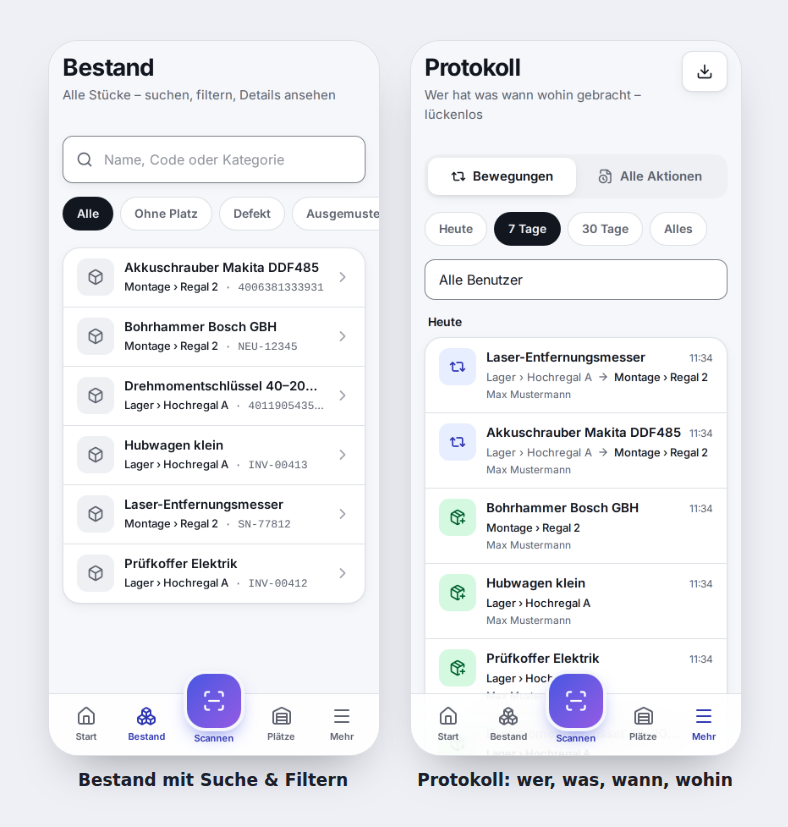

### 6. Benutzer verwalten

Admins legen unter **Benutzer** neue Konten an und vergeben die Rolle. Die App erzeugt ein **Startpasswort**, das beim ersten Anmelden geändert werden muss. Benutzer werden nie gelöscht, nur gesperrt – damit das Protokoll vollständig bleibt.

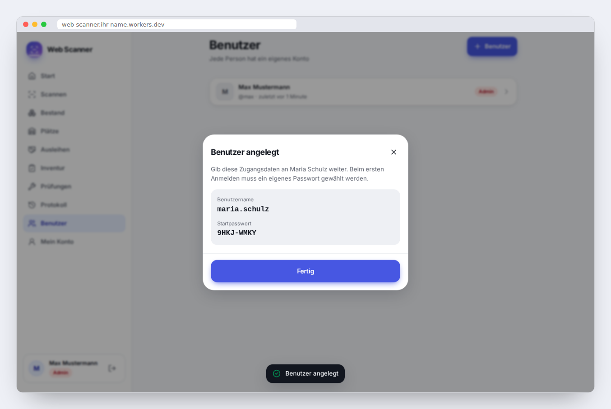

---

## Fotos und Kategorie-Symbole

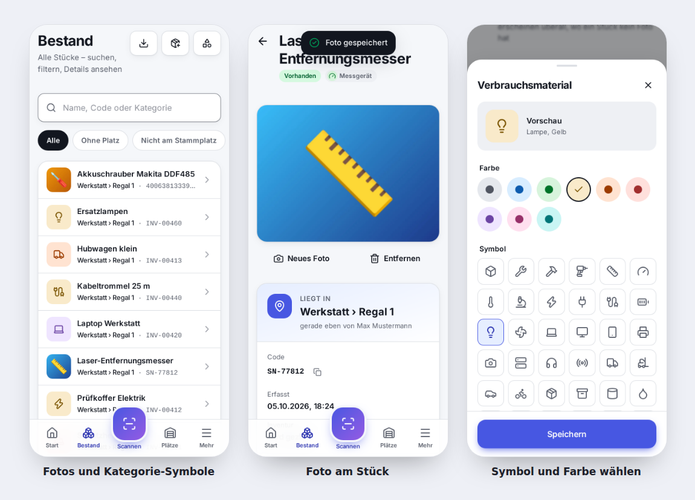

**Fotos**
- Beim **Erfassen** eines neuen Stücks („Foto aufnehmen“) oder später auf der **Stück-Seite** („Foto“ / „Neues Foto“). Das öffnet direkt die Kamera; ein vorhandenes Bild geht auch.
- Die App verkleinert das Foto vor dem Hochladen (großes Bild max. 1200 px, Vorschau 240 px, meist zusammen unter 100 KB) – schnell auch im schwachen WLAN.
- Angezeigt wird es als Vorschaubild in Bestand, Scanliste und Regal-Inhalt; auf der Stück-Seite groß, antippen zum Vergrößern.
- Fotos aufnehmen dürfen **Mitarbeiter**, Leitung und Admin; **entfernen** dürfen Leitung und Admin. Beides steht im Protokoll.
- Gespeichert wird in der Datenbank (D1, 5 GB im kostenlosen Tarif – reicht für weit über 50 000 Fotos). Die JSON-Datensicherung enthält die Fotos nicht.

**Kategorie-Symbole**
- Hat ein Stück kein Foto, zeigt die App das **Symbol seiner Kategorie** in deren Farbe – z. B. 🔧 Werkzeug blau, ⚡ Elektrik gelb, 🚚 Transport orange.
- Passende Symbole werden **automatisch** aus dem Kategorienamen gewählt (Werkzeug, Messgerät, Elektrik, Kabel, IT, PSA, Erste Hilfe, Transport …).
- Die **Leitung** kann unter *Bestand → Kategorien* (oder *Mehr → Kategorien*) für jede Kategorie eines von 43 Symbolen und eine von 9 Farben festlegen.
- Beim Erfassen werden die vorhandenen Kategorien mit Symbol als Vorschläge angezeigt und beim Tippen gefiltert.

---

## Passwort ändern oder vergessen

| Situation | So geht’s |
|---|---|
| **Eigenes Passwort ändern** | *Mein Konto → Passwort ändern*: bisheriges und neues Passwort (mind. 8 Zeichen). Alle anderen Geräte werden dabei abgemeldet. |
| **Neues Konto** | Der Admin legt es mit einem Startpasswort an. Beim ersten Anmelden muss die Person ein eigenes Passwort wählen. |
| **Passwort vergessen** | Ein Admin öffnet *Benutzer → Person → Passwort zurücksetzen*. Die App zeigt ein neues Startpasswort, das beim nächsten Anmelden geändert werden muss. Eine Sperre wird dabei aufgehoben. |
| **5 × falsches Passwort** | Das Konto ist 15 Minuten gesperrt – danach geht es wieder, oder ein Admin setzt das Passwort sofort zurück. |
| **Admin hat sein Passwort vergessen** | Am besten gibt es einen zweiten Admin. Sonst hilft der **Notfall-Code** (unten). |

### Notfall-Code für den Admin-Zugang

Falls kein Admin mehr hineinkommt, kann man auf der Anmeldeseite über **„Admin-Zugang wiederherstellen“** mit einem geheimen Notfall-Code ein neues Admin-Passwort setzen. Es braucht dafür keinen E-Mail-Dienst.

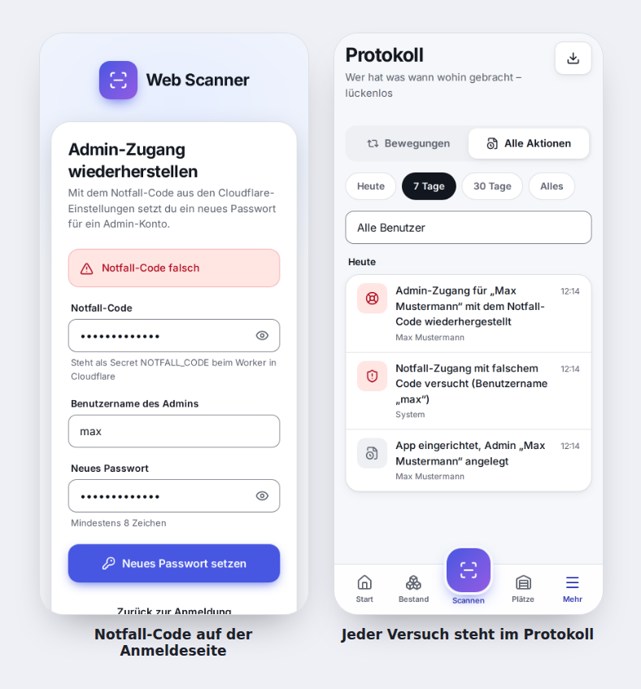

**Einmalig einrichten:**

1. Einen langen Zufallscode ausdenken bzw. erzeugen (mindestens 16 Zeichen, z. B. vom Passwort-Manager) und **sicher aufbewahren** (Passwort-Manager, ausgedruckt im Tresor).
2. Im Cloudflare-Dashboard: **Workers & Pages → web-scanner → Einstellungen → Variablen und Geheimnisse → Hinzufügen**
   - Typ: **Geheimnis (Secret)**
   - Name: `NOTFALL_CODE`
   - Wert: der Code
   - Speichern und bereitstellen.

   Alternativ im Terminal: `npx wrangler secret put NOTFALL_CODE`
3. Ab jetzt erscheint auf der Anmeldeseite der Link **„Admin-Zugang wiederherstellen“**. Ohne hinterlegten Code bleibt die Funktion abgeschaltet und unsichtbar.

**Im Notfall:** Link antippen → Notfall-Code, Benutzername des Admins und neues Passwort eingeben → man ist sofort angemeldet. Alle alten Sitzungen dieses Admins werden beendet.

**Schutz:** höchstens 5 Versuche je Gerät in 15 Minuten und 10 Versuche insgesamt pro Stunde; jeder Versuch – auch ein falscher – steht im Protokoll. Funktioniert nur für Konten mit der Rolle Admin. Den Code nach einer Nutzung am besten neu setzen.

---

## Rollen

| Rolle | Darf |
|---|---|
| **Leser** | scannen, nachsehen wo etwas ist, Verlauf ansehen |
| **Mitarbeiter** | + einlagern, umbuchen, neue Stücke erfassen, Fotos aufnehmen; eigenes Protokoll |
| **Leitung** | + Abteilungen/Regale anlegen, Etiketten drucken, Stücke bearbeiten/ausmustern, Fotos entfernen, Kategorie-Symbole festlegen, komplettes Protokoll + Export |
| **Admin** | + Benutzer anlegen, Rollen vergeben, sperren, Passwort zurücksetzen, Datensicherung |

Die Rechte werden bei **jeder Anfrage auf dem Server** geprüft – nicht nur in der Oberfläche.

---

## Am PC

Am großen Bildschirm gibt es eine Seitenleiste statt der unteren Leiste. Ein USB-Handscanner funktioniert dort ohne Einrichtung.

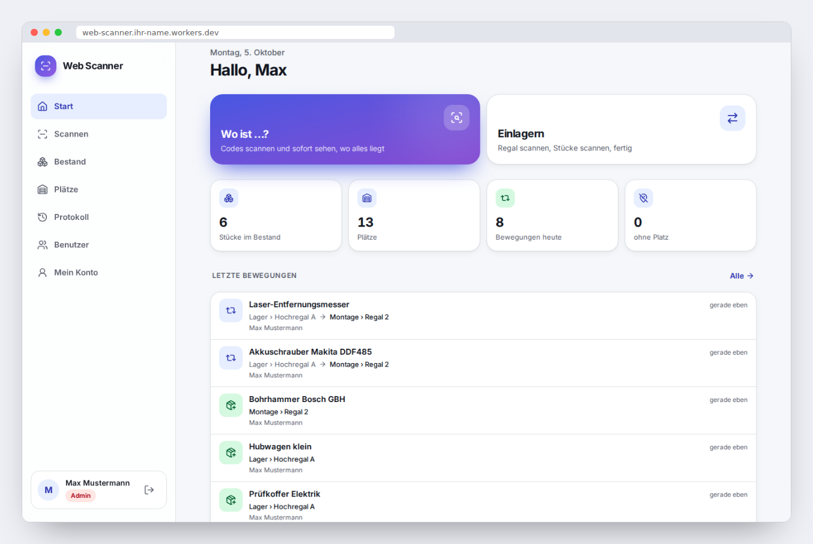

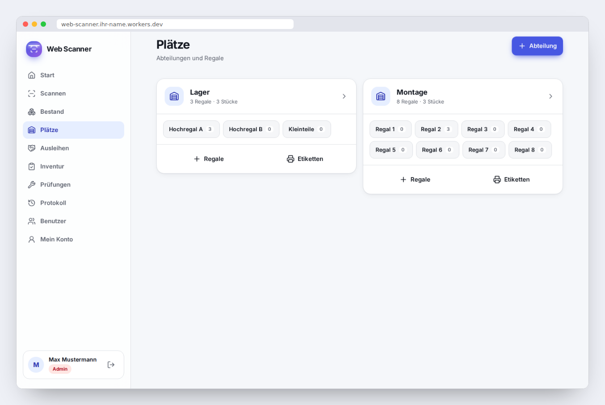

---

## Hell und dunkel

Unter **Mein Konto** wählbar: automatisch (nach Geräteeinstellung), hell oder dunkel.

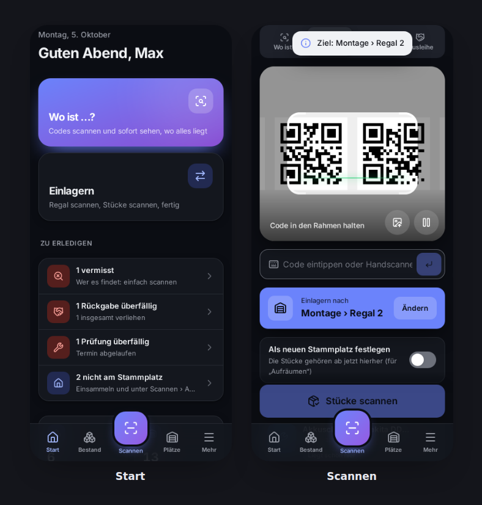

---

## Auf Cloudflare veröffentlichen (kostenlos)

👉 **Ausführliche Schritt-für-Schritt-Anleitung: [docs/cloudflare-einrichten.md](docs/cloudflare-einrichten.md)**

Kurzfassung:

1. Auf GitHub `main` als Standard-Branch einstellen und den Pull Request zusammenführen.
2. Kostenloses Konto auf [dash.cloudflare.com](https://dash.cloudflare.com) anlegen.
3. **D1-Datenbank `web-scanner`** anlegen (Standort Westeuropa).
4. **Workers & Pages → Erstellen → Repository importieren** → dieses Repository; Projektname **`web-scanner`**, Build-Befehl `npm run build`, Deploy-Befehl `npx wrangler deploy`.
5. Die Adresse (`https://web-scanner.<name>.workers.dev`) **sofort** öffnen und das **erste Admin-Konto** anlegen.
6. Den [Notfall-Code](#notfall-code-für-den-admin-zugang) als Geheimnis `NOTFALL_CODE` hinterlegen.

Danach wird jeder Push auf `main` automatisch veröffentlicht.

**Kostenloser Tarif:** 100 000 Anfragen pro Tag, Datenbank bis 5 GB – reicht für viele Tausend Stücke und Dutzende Benutzer. Passwörter werden mit 20 000 PBKDF2-Runden gehasht, damit das Anmelden in die 10 ms Rechenzeit pro Anfrage passt; im bezahlten Tarif `PBKDF2_RUNDEN` in `wrangler.jsonc` auf `100000` setzen.

**Datensicherung:** Cloudflare D1 hält automatisch 7 Tage Verlauf zum Zurückspringen („Time Travel“). Zusätzlich kann ein Admin unter *Mein Konto → Datensicherung* alle Daten als JSON-Datei herunterladen.

---

## Entwicklung

```bash
npm install
npm run dev        # http://localhost:5173 – App + Server + lokale Datenbank
npm test           # API-Tests im echten Workers-Laufzeitsystem
npm run build      # Typprüfung + Bauen
```

Für den Notfall-Code lokal: `.dev.vars.example` nach `.dev.vars` kopieren (wird nicht eingecheckt).

Die Kamera braucht HTTPS – auf `localhost` geht es auch ohne. Am Handy am einfachsten direkt die veröffentlichte Version nutzen.

```
src/
├─ worker/        Server (Cloudflare Worker, Hono): Anmeldung, Rollen, API, Datenbankschema
├─ app/           Oberfläche (React, Tailwind): seiten/, scanner/, komponenten/, ui/ (Design-System)
└─ gemeinsam/     Rollen/Rechte, Prüfregeln, Typen – von Server und Oberfläche genutzt
tests/            API-Tests
docs/             Plan, Design-System, Bilder
```

Weitere Doku:
- [docs/cloudflare-einrichten.md](docs/cloudflare-einrichten.md) – Einrichtung auf Cloudflare, Schritt für Schritt
- [docs/PLAN.md](docs/PLAN.md) – Projektplan und Stand
- [docs/design-system.md](docs/design-system.md) – Farben, Schrift, Komponenten, Barrierefreiheit
