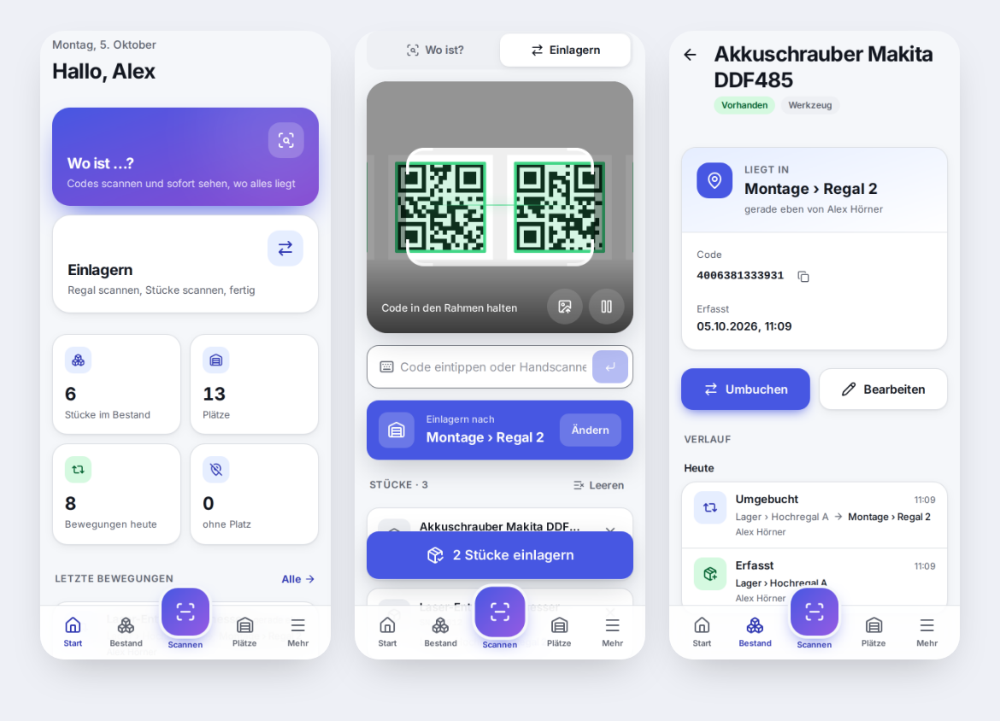

# Web Scanner

Web-App auf **Cloudflare (kostenloser Tarif)** zum Lesen von **Strichcodes und QR-Codes**: mehrere Codes scannen, sofort sehen, **wo jedes Stück liegt**, Stücke einlagern und umbuchen – mit **eigenen Benutzerkonten**, **Rollen** und **lückenlosem Protokoll**.



## Funktionen

- **Scannen mit der Kamera** (iPhone, Android, PC) – mehrere Codes nacheinander oder gleichzeitig im Bild, Ton + Vibration, Taschenlampe. QR, DataMatrix, Code 128/39/93, EAN-13/8, UPC, ITF, Codabar.
- **Foto auswerten**: ein Foto mit vielen Etiketten → alle Codes auf einmal.
- **Handscanner** (USB/Bluetooth) und **Eintippen** funktionieren genauso.
- **„Wo ist …?“**: gescannte Stücke zeigen sofort Abteilung › Regal, wann und von wem zuletzt bewegt.
- **Einlagern / Umbuchen**: Regal-Etikett scannen → Stücke scannen → ein Tipp. Alles in einer Transaktion.
- **Unbekannte Codes direkt erfassen** (Name, Kategorie) – gleich ins gescannte Regal.
- **Plätze**: Abteilungen → Regale (→ Fächer), Regale auch als Reihe („Regal 1“ bis „Regal 20“) anlegen.
- **QR-Etiketten drucken** für Regale (A4-Bögen 21 oder 8 pro Seite).
- **Bestand** mit Suche und Filtern (ohne Platz, defekt, ausgemustert), **Verlauf je Stück**.
- **Protokoll**: jede Bewegung und jede Änderung – wer, was, wann, von wo nach wo. **Unveränderbar** (Datenbank-Trigger), Export als **CSV für Excel**.
- **Benutzer und Rollen**: Leser · Mitarbeiter · Leitung · Admin. Jede Person hat ein eigenes Konto; Startpasswort muss beim ersten Anmelden geändert werden; Sperre nach 5 Fehlversuchen.
- **Hell / Dunkel / automatisch**, große Bedienelemente (≥ 48 px, Hauptaktionen 56–64 px), als App auf dem Handy installierbar.


## Rollen

| Rolle | Darf |
|---|---|
| Leser | scannen, nachsehen wo etwas ist, Verlauf ansehen |
| Mitarbeiter | + einlagern, umbuchen, neue Stücke erfassen; eigenes Protokoll |
| Leitung | + Abteilungen/Regale anlegen, Etiketten drucken, Stücke bearbeiten/ausmustern, komplettes Protokoll + Export |
| Admin | + Benutzer anlegen, Rollen vergeben, sperren, Passwort zurücksetzen, Datensicherung |

Die Rechte werden bei **jeder Anfrage auf dem Server** geprüft.

## Auf Cloudflare veröffentlichen (kostenlos)

1. Kostenloses Konto auf [dash.cloudflare.com](https://dash.cloudflare.com) anlegen.
2. **Workers & Pages → Erstellen → „Repository importieren“** → GitHub verbinden → dieses Repository wählen.
3. Einstellungen übernehmen:
   - Build-Befehl: `npm run build`
   - Deploy-Befehl: `npx wrangler deploy`
   - Produktions-Branch: `main`
4. **Bereitstellen.** Die Datenbank (D1, Name `web-scanner`) legt `wrangler deploy` beim ersten Mal selbst an; die Tabellen legt die App beim ersten Aufruf selbst an.
   Falls die Bereitstellung wegen der Datenbank abbricht: unter **Storage & Databases → D1** eine Datenbank `web-scanner` anlegen und deren ID in `wrangler.jsonc` als `"database_id"` eintragen.
5. Die angezeigte Adresse (`https://web-scanner.<name>.workers.dev`) **sofort** öffnen und das **erste Admin-Konto** anlegen – solange es keinen Benutzer gibt, kann das jeder mit der Adresse.
6. Unter **Plätze** Abteilungen und Regale anlegen, Etiketten drucken, aufkleben – los geht’s.

Danach wird jeder Push auf `main` automatisch veröffentlicht.

**Kostenloser Tarif:** 100 000 Anfragen/Tag, D1 5 GB. Das reicht für viele Tausend Stücke und Dutzende Benutzer. Passwörter werden deshalb mit 20 000 PBKDF2-Runden gehasht (passt in die 10 ms CPU je Anfrage); im bezahlten Tarif `PBKDF2_RUNDEN` in `wrangler.jsonc` auf `100000` setzen.

**Datensicherung:** D1 hält automatisch 7 Tage Verlauf zum Zurückspringen („Time Travel“). Zusätzlich kann ein Admin unter *Mein Konto → Datensicherung* alle Daten als JSON herunterladen.

## Entwicklung

```bash
npm install
npm run dev        # http://localhost:5173 – App + Worker + lokale Datenbank
npm test           # API-Tests im echten Workers-Laufzeitsystem (Miniflare)
npm run build      # Typprüfung + Bauen
```

Die Kamera braucht HTTPS – auf `localhost` geht es auch ohne. Zum Testen am Handy im gleichen WLAN: `npm run dev -- --host` und die Seite per HTTPS-Tunnel öffnen, oder direkt die veröffentlichte Version nutzen.

## Aufbau

```
src/
├─ worker/        Server (Cloudflare Worker, Hono): Anmeldung, Rollen, API, Datenbankschema
├─ app/           Oberfläche (React, Tailwind): seiten/, scanner/, komponenten/, ui/ (Design-System)
└─ gemeinsam/     Rollen/Rechte, Prüfregeln (zod), Typen – von beiden Seiten genutzt
tests/            API-Tests
docs/             Plan, Design-System
```

- [docs/PLAN.md](docs/PLAN.md) – Projektplan und Stand
- [docs/design-system.md](docs/design-system.md) – Farben, Schrift, Komponenten, Barrierefreiheit
